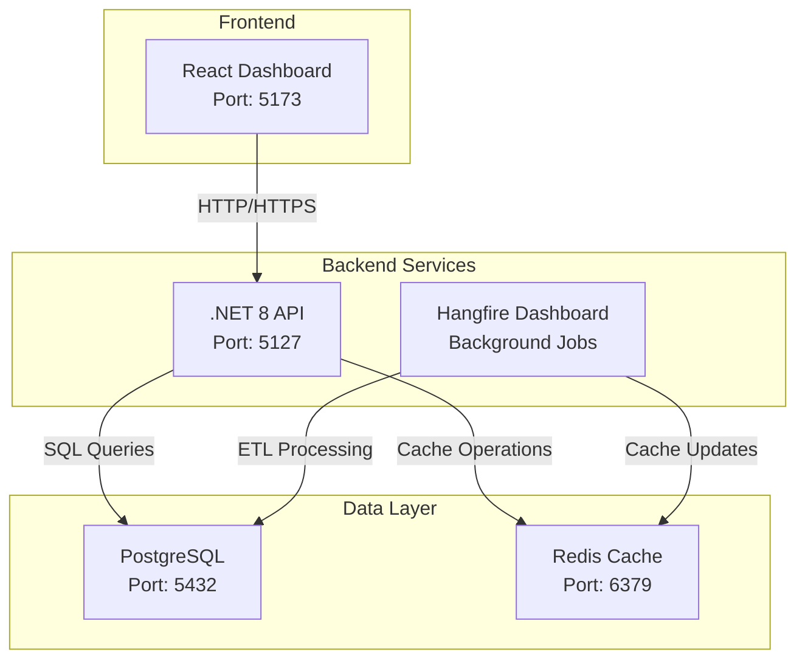
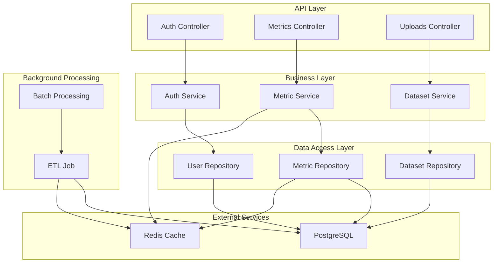
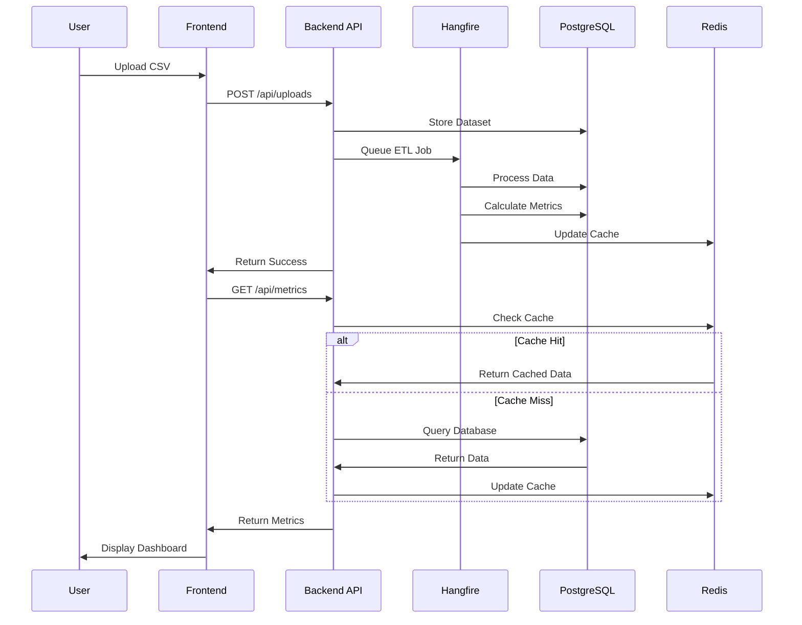
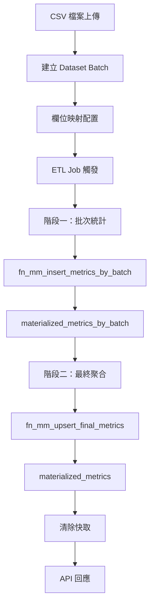
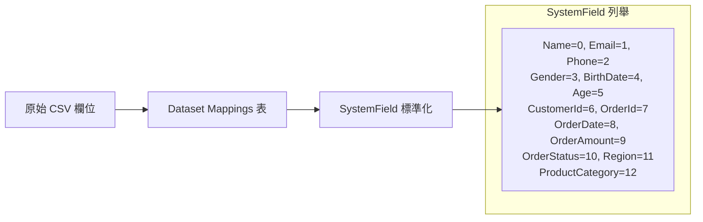
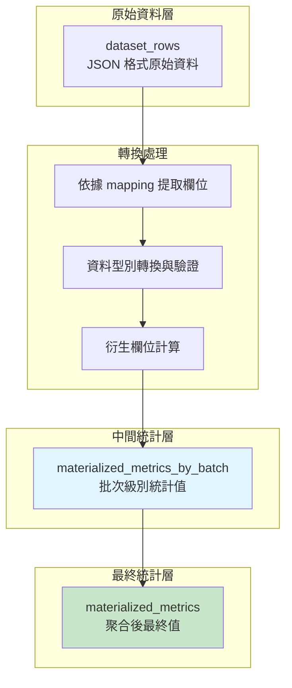
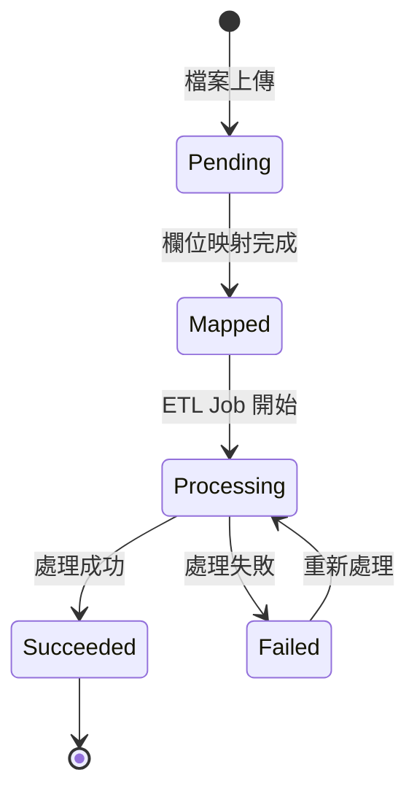
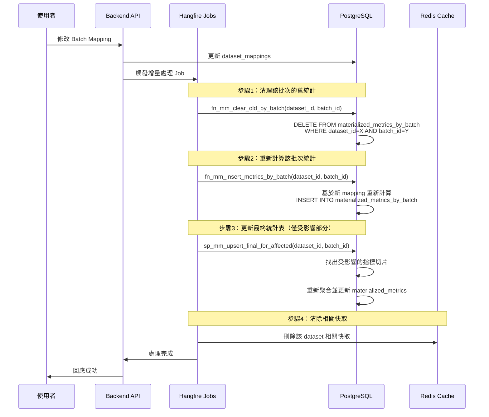
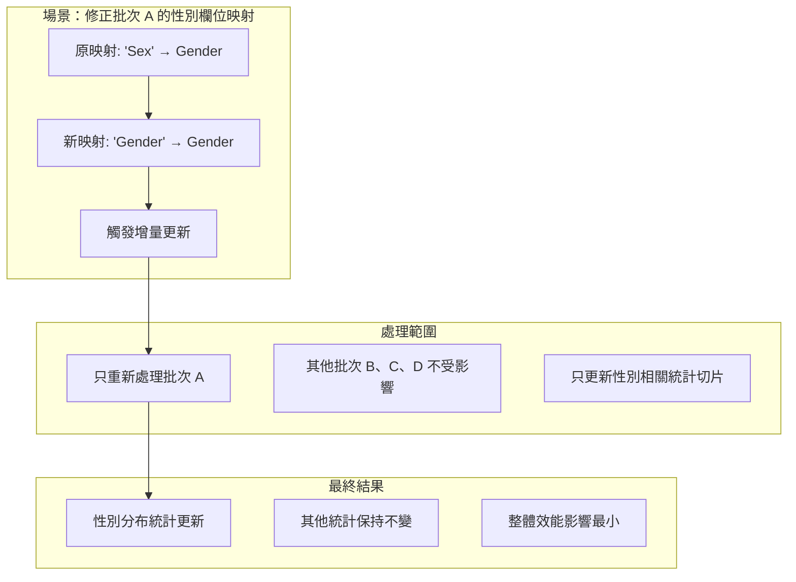

# BI Dashboard Backend

一個基於 .NET 8 的商業智慧儀表板後端服務，提供資料處理、指標計算和 API 服務。

## 🚀 技術棧

- **.NET 8** - 主要開發框架
- **ASP.NET Core** - Web API 框架
- **PostgreSQL** - 主要資料庫
- **Redis** - 快取服務
- **Hangfire** - 背景工作排程
- **Dapper** - 輕量級 ORM
- **Serilog** - 結構化日誌記錄
- **JWT** - 身份驗證
- **Swagger** - API 文件

## 📋 系統需求

- .NET 8 SDK
- PostgreSQL 12+
- Redis 6+
- Docker (可選，用於容器化部署)

## 🛠️ 環境設置

### 1. 克隆專案

```bash
git clone https://github.com/austin72905/BIDashboard.git
cd BIDashboardBackend
```

### 2. 資料庫設置

#### PostgreSQL 設置

```bash
# 使用 Docker 啟動 PostgreSQL
docker run --name bi-postgres \
  -e POSTGRES_DB=bidb \
  -e POSTGRES_USER=admin \
  -e POSTGRES_PASSWORD=admin123 \
  -p 5432:5432 \
  -d postgres:15


#### Redis 設置

```bash
# 使用 Docker 啟動 Redis
docker run --name bi-redis \
  -p 6379:6379 \
  -d redis:7-alpine


### 3. 資料庫初始化

執行專案中的 SQL 腳本建立必要的資料表和函數：

```bash
# 連接到 PostgreSQL 並執行初始化腳本
psql -h localhost -U admin -d bidb -f scripts/schema.sql
```


## 📚 API 文件

啟動專案後，可透過以下網址查看 API 文件：

- Swagger UI: `http://localhost:5127/swagger`
- OpenAPI JSON: `http://localhost:5127/swagger/v1/swagger.json`

## 🔧 主要功能

### 資料處理
- **檔案上傳**: 支援 CSV 檔案上傳和解析
- **欄位映射**: 動態欄位映射配置
- **批次處理**: 使用 Hangfire 進行背景批次處理
- **ETL 流程**: 完整的 Extract-Transform-Load 流程

### 指標計算
- **KPI 摘要**: 總營收、客戶數、訂單數等關鍵指標
- **趨勢分析**: 月營收趨勢、客戶增長趨勢
- **分布統計**: 地區分布、年齡分布、性別分布
- **產品分析**: 產品類別銷售統計

### 快取機制
- **Redis 快取**: 提升查詢效能
- **智慧快取**: 自動快取失效和更新
- **快取監控**: 快取命中率記錄

### 日誌記錄
- **結構化日誌**: 使用 Serilog 記錄結構化日誌
- **多層級記錄**: Debug、Info、Warning、Error
- **檔案輪替**: 自動日誌檔案輪替和清理
- **效能監控**: 記錄查詢耗時和快取狀態

## 🏗️ 系統架構

### 整體架構圖



### 後端服務架構



### 資料流程圖



## 📁 專案結構

```
BIDashboardBackend/
├── source/
│   └── BIDashboardBackend/
│       ├── Controllers/          # API 控制器
│       ├── Services/            # 業務邏輯服務
│       ├── Repositories/        # 資料存取層
│       ├── Features/            # 功能模組
│       │   ├── Jobs/           # Hangfire 背景工作
│       │   └── Ingest/         # 資料攝取
│       ├── Models/             # 資料模型
│       ├── DTOs/               # 資料傳輸物件
│       ├── Interfaces/         # 介面定義
│       ├── Configs/            # 配置類別
│       ├── Caching/            # 快取服務
│       ├── Database/           # 資料庫相關
│       └── Utils/              # 工具類別
├── tests/                      # 單元測試
├── docs/                       # 文件
│   └── images/                 # 架構圖和說明圖片
├── scripts/                    # 資料庫腳本
└── Dockerfile                  # Docker 配置
```

## 🗄️ 資料庫設計

### 核心設計理念

本系統採用**兩階段聚合**的設計模式，先計算每個批次的中間統計值，再聚合為最終統計表，以達到高效能和資料一致性。

### 主要資料表

#### 1. 資料集相關表

```sql
-- 資料集主表
datasets (id, name, owner_id, created_at, updated_at)

-- 資料集批次表
dataset_batches (
    id, dataset_id, source_filename, total_rows, 
    status, error_message, created_at, updated_at
)

-- 資料集欄位映射表
dataset_mappings (
    id, batch_id, source_column, system_field, 
    created_at, updated_at
)

-- 原始資料行表
dataset_rows (
    id, batch_id, row_json, created_at
)
```

#### 2. 統計值表（兩階段聚合）

```sql
-- 批次級別統計表（中間統計值）
materialized_metrics_by_batch (
    id, dataset_id, batch_id, metric_key, bucket, period,
    sum_value, count_value, updated_at
)

-- 最終統計表（聚合結果）
materialized_metrics (
    id, dataset_id, metric_key, bucket, period,
    value, updated_at
)
```

### 兩階段聚合流程



### 批次資料轉換中間表處理流程

本系統設計的核心優勢在於**增量處理能力**：當某個 batch 的 mapping 發生變更時，不需要重新計算整個 dataset，只需重新處理該批次並更新最終統計。

#### 1. 欄位映射 (Mapping) 階段



每個批次的原始欄位透過 `dataset_mappings` 表對應到標準化的 `SystemField`：

```sql
-- 欄位映射範例
INSERT INTO dataset_mappings (batch_id, source_column, system_field) VALUES
(1, '客戶姓名', 0),      -- Name
(1, '性別', 3),          -- Gender  
(1, '年齡', 5),          -- Age
(1, '訂單日期', 8),      -- OrderDate
(1, '訂單金額', 9),      -- OrderAmount
(1, '地區', 11);         -- Region
```

#### 2. 中間表轉換流程



#### 3. 資料型別轉換與驗證

系統會依據 mapping 從 JSON 格式的原始資料中提取對應欄位，並進行嚴格的資料驗證：

```sql
-- 提取並轉換資料的核心邏輯（摘自 fn_mm_insert_metrics_by_batch）
CREATE TEMP TABLE _rows_raw AS
SELECT
  (r.row_json ->> (SELECT column_name FROM _map WHERE system_field = 8)) AS order_date_txt,
  (r.row_json ->> (SELECT column_name FROM _map WHERE system_field = 9)) AS order_amount_txt,
  (r.row_json ->> (SELECT column_name FROM _map WHERE system_field = 3)) AS gender_txt,
  -- ... 其他欄位
FROM dataset_rows r
WHERE r.batch_id = p_batch_id;

-- 資料正規化與驗證
CREATE TEMP TABLE _norm AS  
SELECT
  -- 安全的日期轉換（使用自定義函數）
  safe_date_convert(order_date_txt) AS order_date,
  
  -- 數值驗證（僅接受有效數字格式）
  CASE WHEN order_amount_txt ~ '^\s*-?\d+(\.\d+)?\s*$' 
       THEN TRIM(order_amount_txt)::NUMERIC 
  END AS order_amount,
  
  -- 年齡範圍限制（0-100歲）
  CASE WHEN age_txt ~ '^[0-9]+$' AND age_txt::INT BETWEEN 0 AND 100
       THEN TRIM(age_txt)::INT 
  END AS age,
  
  -- 計算衍生欄位：月份期間
  COALESCE(date_trunc('month', order_date)::DATE, '1900-01-01') AS period_month,
  
  -- 計算衍生欄位：年齡區間 
  CASE WHEN age IS NOT NULL 
       THEN CONCAT((age/10)*10, '-', (age/10)*10 + 9) 
  END AS age_bucket
FROM _rows_raw;
```

#### 4. 中間統計值計算

系統會針對不同類型的指標計算中間統計值，儲存在 `materialized_metrics_by_batch` 表中：

```sql
-- 範例：計算每月營收統計
INSERT INTO materialized_metrics_by_batch 
  (dataset_id, batch_id, metric_key, bucket, period, sum_value)
SELECT dataset_id, batch_id, 0, NULL, period_month, SUM(order_amount)
FROM _norm
WHERE order_amount IS NOT NULL
GROUP BY dataset_id, batch_id, period_month;

-- 範例：計算性別分布統計
INSERT INTO materialized_metrics_by_batch
  (dataset_id, batch_id, metric_key, bucket, period, count_value)
SELECT dataset_id, batch_id, 12, gender, v_sentinel_period, COUNT(*)
FROM _norm
WHERE gender IS NOT NULL
GROUP BY dataset_id, batch_id, gender;
```

#### 5. 依據不同 Period 統計

系統支援多種時間維度的統計：

| Period 類型 | 說明 | 應用場景 |
|------------|------|----------|
| **月份期間** | `period_month` | 營收趨勢、訂單量變化 |
| **哨兵期間** | `1900-01-01` | 不依時間的分布統計（性別、年齡、地區） |
| **自定義期間** | 可擴展支援季度、年度 | 長期趨勢分析 |

```sql
-- 時間相關指標（按月統計）
INSERT INTO materialized_metrics_by_batch 
  (dataset_id, batch_id, metric_key, period, sum_value)
SELECT dataset_id, batch_id, 0, period_month, SUM(order_amount)
FROM _norm 
WHERE period_month IS NOT NULL
GROUP BY dataset_id, batch_id, period_month;

-- 分布類指標（使用哨兵期間，不按時間分組）
INSERT INTO materialized_metrics_by_batch
  (dataset_id, batch_id, metric_key, bucket, period, count_value)  
SELECT dataset_id, batch_id, 12, gender, DATE '1900-01-01', COUNT(*)
FROM _norm
WHERE gender IS NOT NULL
GROUP BY dataset_id, batch_id, gender;
```

### 統計指標類型

系統支援以下統計指標：

| 指標類型 | MetricKey | 說明 | 聚合方式 |
|---------|-----------|------|----------|
| 總營收 | TotalRevenue | 所有訂單的總金額 | SUM |
| 總客戶數 | TotalCustomers | 不重複客戶數量 | COUNT DISTINCT |
| 總訂單數 | TotalOrders | 訂單總筆數 | COUNT |
| 平均訂單金額 | AvgOrderValue | 總營收/總訂單數 | SUM/COUNT |
| 新客戶數 | NewCustomers | 指定期間內的新客戶 | COUNT |
| 月營收趨勢 | MonthlyRevenueTrend | 按月分組的營收 | SUM by Period |
| 地區分布 | RegionDistribution | 各地區的訂單分布 | COUNT by Region |
| 產品類別銷售 | ProductCategorySales | 各類別產品銷量 | COUNT by Category |
| 年齡分布 | AgeDistribution | 客戶年齡分布 | COUNT by Age Group |
| 性別占比 | GenderShare | 客戶性別分布 | COUNT by Gender |

### 批次處理狀態



### 增量更新機制：單個 Batch 變更 Mapping 的處理

本系統的核心優勢在於支援**細粒度的增量更新**。當某個 batch 的 mapping 配置發生變更時，系統只需重新處理該批次，而無需重新計算整個 dataset 的所有統計值。

#### 增量更新流程圖



#### 關鍵技術實現

##### 1. 批次級別的獨立處理

每個 batch 的統計資料完全獨立儲存在 `materialized_metrics_by_batch` 表中：

```sql
-- 清除指定批次的舊統計（避免重複累計）
CREATE FUNCTION fn_mm_clear_old_by_batch(p_dataset_id bigint, p_batch_id bigint)
RETURNS void AS $$
BEGIN
  DELETE FROM materialized_metrics_by_batch
  WHERE dataset_id = p_dataset_id AND batch_id = p_batch_id;
END;
$$;
```

##### 2. 影響範圍精確定位

系統能精確找出受單一 batch 變更影響的統計切片：

```sql
-- 找出受影響的指標切片（摘自 sp_mm_upsert_final_for_affected）
CREATE TEMP TABLE _affected AS
SELECT DISTINCT dataset_id, metric_key, bucket, period
FROM materialized_metrics_by_batch
WHERE dataset_id = p_dataset_id AND batch_id = p_batch_id;
```

##### 3. 智慧聚合策略

針對不同類型的指標採用對應的聚合策略：

```sql
-- Sum 類型指標（營收、銷售額）
SELECT SUM(sum_value) FROM materialized_metrics_by_batch 
WHERE dataset_id = ? AND metric_key IN (0, 8, 9)
GROUP BY dataset_id, metric_key, bucket, period;

-- Count 類型指標（訂單數、客戶數）  
SELECT SUM(count_value) FROM materialized_metrics_by_batch
WHERE dataset_id = ? AND metric_key IN (1, 2, 6, 11)
GROUP BY dataset_id, metric_key, bucket, period;

-- Average 類型指標（平均訂單金額）
SELECT SUM(sum_value) / SUM(count_value) FROM materialized_metrics_by_batch
WHERE dataset_id = ? AND metric_key = 3
GROUP BY dataset_id, metric_key, bucket, period;

-- Share 類型指標（佔比分布）
SELECT count_value / SUM(count_value) OVER (PARTITION BY dataset_id, metric_key, period)
FROM materialized_metrics_by_batch
WHERE dataset_id = ? AND metric_key IN (10, 12);
```

#### 增量更新的優勢

| 傳統全量更新 | 本系統增量更新 |
|-------------|----------------|
| 重新處理整個 dataset | 只處理變更的 batch |
| 處理時間隨資料量線性增長 | 處理時間固定（單批次） |
| 需要大量系統資源 | 資源消耗最小化 |
| 處理期間影響其他查詢 | 影響範圍最小 |
| 失敗需全部重來 | 失敗只影響單一批次 |

#### 實際應用場景



### 效能優化策略

#### 1. 增量更新
- **批次級別獨立性**：每個 batch 統計完全獨立
- **精確影響範圍**：只更新受變更影響的統計切片
- **智慧聚合**：依指標類型採用最佳聚合策略

#### 2. 快取機制
- **分層快取**：批次級別 + 最終統計雙層快取
- **精確失效**：只清除受影響 dataset 的相關快取
- **預熱策略**：處理完成後主動預熱常用查詢

#### 3. 並行處理
- **批次並行**：多個批次可同時處理（不同 dataset）
- **指標並行**：同一批次內不同指標可並行計算
- **聚合並行**：最終聚合階段支援並行更新

#### 4. 索引設計
```sql
-- 批次統計表索引（支援快速定位受影響切片）
CREATE INDEX idx_mmbb_dataset_metric_bucket_period 
ON materialized_metrics_by_batch(dataset_id, metric_key, bucket, period);

-- 最終統計表索引（支援快速查詢和更新）
CREATE INDEX idx_mm_dataset_metric_bucket 
ON materialized_metrics(dataset_id, metric_key, bucket, period);

-- 批次查詢索引（支援影響範圍分析）
CREATE INDEX idx_mmbb_batch 
ON materialized_metrics_by_batch(batch_id);
```

#### 5. 實際程式碼範例

在 C# 後端服務中，增量更新的觸發流程如下：

```csharp
// 當使用者修改批次映射時觸發
public async Task<bool> UpdateBatchMappingAsync(long batchId, List<DatasetMappingDto> newMappings)
{
    using var transaction = await _unitOfWork.BeginTransactionAsync();
    try
    {
        // 1. 更新映射配置
        await _datasetRepository.UpdateBatchMappingsAsync(batchId, newMappings);
        
        // 2. 取得批次資訊
        var batch = await _datasetRepository.GetBatchAsync(batchId);
        
        // 3. 觸發增量更新 Job（非同步背景處理）
        _backgroundJobClient.Enqueue<IncrementalUpdateJob>(
            job => job.ProcessSingleBatchAsync(batch.DatasetId, batchId));
        
        // 4. 更新批次狀態
        await _datasetRepository.UpdateBatchStatusAsync(batchId, "Processing");
        
        await transaction.CommitAsync();
        return true;
    }
    catch (Exception ex)
    {
        await transaction.RollbackAsync();
        _logger.LogError(ex, "更新批次映射失敗: BatchId={BatchId}", batchId);
        return false;
    }
}

// Hangfire 背景工作：增量更新處理
public class IncrementalUpdateJob
{
    public async Task ProcessSingleBatchAsync(long datasetId, long batchId)
    {
        try
        {
            // 1. 清理該批次的舊統計
            await _sqlRunner.ExecuteAsync(
                "SELECT fn_mm_clear_old_by_batch(@datasetId, @batchId)",
                new { datasetId, batchId });
            
            // 2. 重新計算該批次統計
            await _sqlRunner.ExecuteAsync(
                "SELECT fn_mm_insert_metrics_by_batch(@datasetId, @batchId)",
                new { datasetId, batchId });
            
            // 3. 更新最終統計表（僅受影響部分）
            await _sqlRunner.ExecuteAsync(
                "CALL sp_mm_upsert_final_for_affected(@datasetId, @batchId)",
                new { datasetId, batchId });
            
            // 4. 清除相關快取
            await _cacheService.RemoveByPatternAsync($"metrics:dataset:{datasetId}:*");
            
            // 5. 更新批次狀態
            await _datasetRepository.UpdateBatchStatusAsync(batchId, "Succeeded");
            
            _logger.LogInformation("增量更新完成: DatasetId={DatasetId}, BatchId={BatchId}", 
                datasetId, batchId);
        }
        catch (Exception ex)
        {
            await _datasetRepository.UpdateBatchStatusAsync(batchId, "Failed", ex.Message);
            _logger.LogError(ex, "增量更新失敗: DatasetId={DatasetId}, BatchId={BatchId}", 
                datasetId, batchId);
            throw;
        }
    }
}
```

### 資料一致性保證

1. **交易控制**：整個 ETL 流程包在資料庫交易中
2. **原子操作**：批次處理成功後才更新最終統計表
3. **錯誤回滾**：處理失敗時自動回滾所有變更
4. **狀態追蹤**：透過 `dataset_batches.status` 追蹤處理狀態
5. **冪等性保證**：同一批次可安全重複執行（先清理後重建）

## 🔐 身份驗證

專案使用 JWT 進行身份驗證：

```bash
# 登入取得 Token
curl -X POST https://localhost:5127/api/auth/login \
  -H "Content-Type: application/json" \
  -d '{"email": "user@example.com", "password": "password"}'

# 使用 Token 存取受保護的 API
curl -X GET https://localhost:5127/api/metrics/kpi-summary/1 \
  -H "Authorization: Bearer <your-token>"
```

## 📊 監控和日誌

### 日誌位置
- **開發環境**: Console 輸出
- **生產環境**: `logs/bidashboard-{date}.log`

### 背景工作監控
- Hangfire Dashboard: `https://localhost:7000/hangfire`

### 日誌等級
- **Debug**: 詳細的除錯資訊
- **Info**: 一般資訊和業務操作
- **Warning**: 警告訊息
- **Error**: 錯誤和異常

## 🧪 測試

```bash
# 執行單元測試
dotnet test

# 執行特定測試專案
dotnet test tests/BIDashboardBackend.Tests
```

## 🚀 部署

### 生產環境配置

預設使用appsettings.json的設定，如果有環境變數，就用環境變數覆蓋 (可選)

1. 設定環境變數：
```bash
export ConnectionStrings__Pg="Host=prod-db;Port=5432;Database=bidb;Username=prod_user;Password=secure_password"
export Redis__ConnectionString="prod-redis:6379"
export JwtSettings__SecretKey="your-secure-secret-key"
```


### Docker 部署

```bash
# 使用 docker-compose
docker-compose up -d
```


